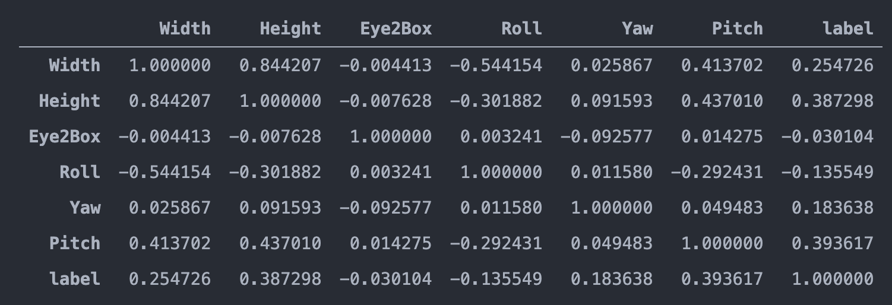

# 노트북 자세 판별기
2020-2 YBIGTA 컨퍼런스

### References

* [Facial landmarks with dlib, OpenCV, and Python](https://www.pyimagesearch.com/2017/04/03/facial-landmarks-dlib-opencv-python/)
* [Detect eyes, nose, lips, and jaw with dlib, OpenCV, and Python](https://www.pyimagesearch.com/2017/04/10/detect-eyes-nose-lips-jaw-dlib-opencv-python/)
* [Yaw Pitch Roll Detection using Retina Face](https://github.com/fisakhan/Face_Pose)
* [Simple Random Forest Classification Example](https://github.com/codebasics/py/blob/master/ML/11_random_forest/11_random_forest.ipynb)
* [Random Forest Hyperparameter Tuning](https://towardsdatascience.com/hyperparameter-tuning-the-random-forest-in-python-using-scikit-learn-28d2aa77dd74)
* [Saving Models with Scikit-learn](https://scikit-learn.org/stable/modules/model_persistence.html)

### Description

Pitch, Roll, Yaw는 회전 축을 세 개로 쪼개놓은 것이다. 

얼굴의 크기(Width, Height)와 Pitch가 자세와 유의미한 상관관계가 있음을 보여준다.

